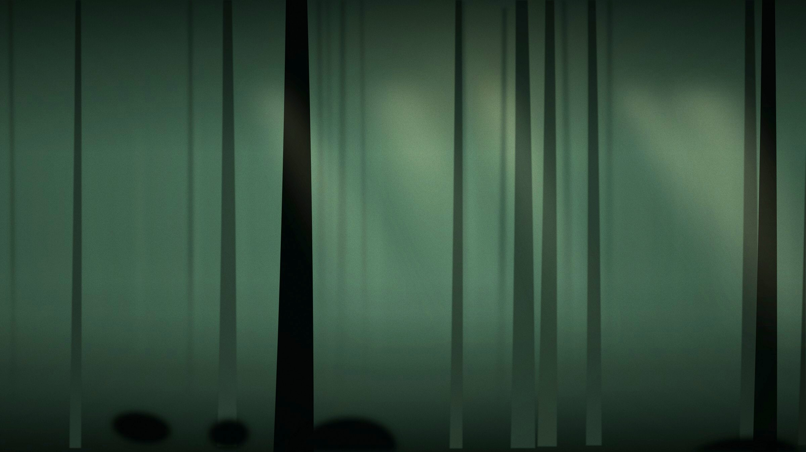

# Stage 01 + 02 · 建案資訊網站

「沐森 MUSEN」建案介紹單頁網站。**同一份檔案帶兩個階段**：
Stage 01 講純文字排版的部分，Stage 02 講圖片怎麼跟網頁連起來。

## 檔案

```
01-info-website/
├── index.html
└── images/
    ├── hero.jpg      首屏底圖（森林）
    ├── space-1.jpg   起居
    ├── space-2.jpg   主臥
    └── space-3.jpg   中庭
```

用瀏覽器直接打開 `index.html` 即可。

## 兩個階段怎麼分

**Stage 01** — 先只看文字的部分：首屏標題、生活尺度（五分鐘主打）、建築理念、
規劃特色、格局配置、聯絡資訊。這個階段的重點是「怎麼把需求講清楚給 AI」，
還不需要提到圖片。

**Stage 02** — 再看圖片：首屏底圖與「空間圖輯」區塊。核心是讓學員看懂

```html

```

這一行在講什麼——網頁只記住圖片放在哪，換照片不用改網頁。

`images/` 裡的四張是示意圖，供學員替換成自己的照片。兩種換法：

1. 把自己的照片改名成 `hero.jpg`，複製進 `images/` 蓋掉原本那張，回瀏覽器重新整理。
2. 照片放進 `images/` 不改名，把網頁裡的檔名改成自己的，存檔重新整理。

建議現場故意打錯一次檔名，讓學員看到破圖再修好，體驗過一次比講三遍有用。

寄給同事的時候要**整個資料夾一起寄**，只寄 `index.html` 過去圖會全部破掉。

## 提醒學員

手機拍的照片通常 3–5 MB，直接放進去頁面會很慢。`hero.jpg` 目前約 370 KB，
可以當成參考值——太大的照片先縮過再放。

## 設定

台中七期經貿園區的高端住宅，客群為中高階城市菁英，
主打「步行五分鐘抵達台中市政府捷運站」與森林中庭。

建案名稱、地址、規格與聯絡資訊均為虛構，圖片為示意圖。

## 關於視覺

刻意只做暗場單一主題，不提供亮色版本——高端建案文宣的視覺世界就是夜色，
做亮色版會稀釋掉私宅感。這是設計選擇，不是遺漏，值得在課堂上提一句。
